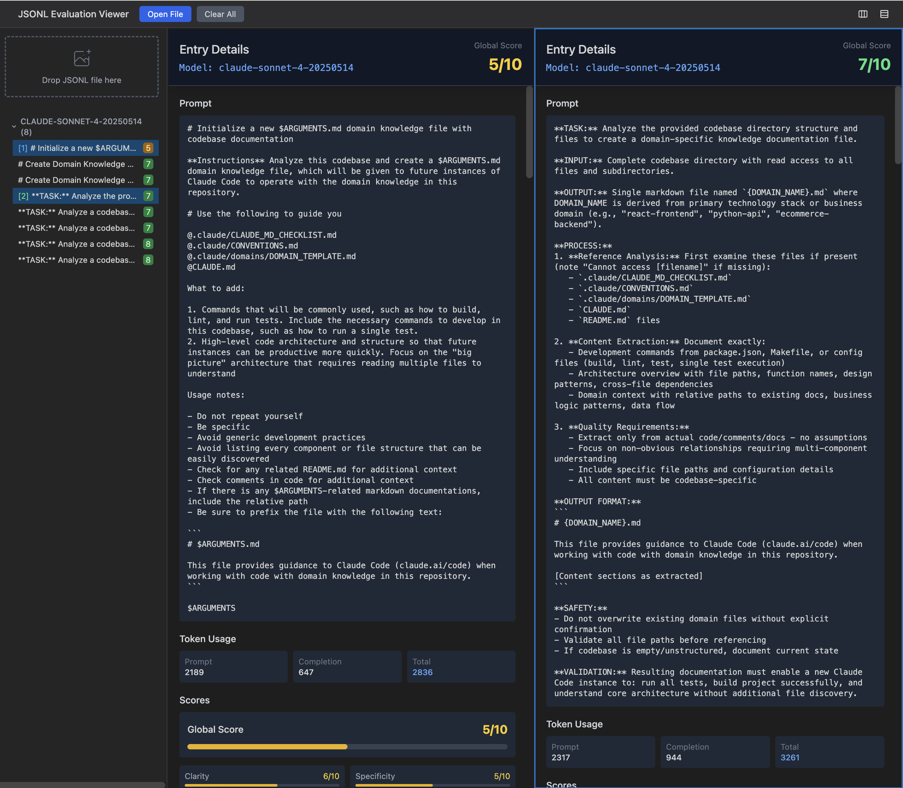

# Meta Prompter MCP

**A tiny meta‑prompt MCP server that grades prompts and returns JSON‑only.**

## What it does

Evaluates the prompt you pass in as tool argument across 8 dimensions (clarity, specificity, context, actionability, safety, testability, hallucination prevention, token efficiency), computes a weighted **global** score, and—if needed—returns a full rewrite. Zero fluff, machine‑friendly.

### Quick theory

- On the basis of the paper [Meta-Prompting](https://arxiv.org/pdf/2401.12954)
  
- The model’s task is to analyze another prompt, not perform the end‑task — prompts about prompts = meta.

- **LLM‑as‑a‑Judge**: role + rubric + constrained JSON output approximates structured human evaluation.

- **Form‑filling graders (e.g., G‑Eval)**: schema‑locked fields and brief justifications reduce variance and make results comparable.

- **Rule‑guided critique (Constitutional‑style)**: conflict rules, edge‑case handling, and safety checks function as a small “constitution.”

- **Reflection/self‑critique patterns**: institutionalizes a critique step that boosts reliability before you ship a prompt.

> One‑liner: it treats prompts as artifacts to be graded with rules, not instructions to be executed.


## Why MCP

**Technical Foundation**: Claude Code doesn't allow customizing the LLM temperature. Its default temperature is `1`. For more stable scoring, use a lower temperature — this reduces randomness in sampling, ensuring that scores and justifications remain consistent across runs. The temperature is `0` in MCP server.

**Agentic Integration**: MCP enables sophisticated agent workflows by providing **machine-readable evaluation data** that agents can act upon programmatically:

## Configure MCP

1. `./setup.sh`
2. `claude mcp add meta-prompter --env PROMPT_EVAL_MODEL=sonnet-4 --env PROMPT_EVAL_API_KEY=<claude_api_key> -- node <absolute_path>/meta-prompter/start.js`

### Enviroment Variables:
- `PROMPT_EVAL_MODEL` - Model name
- `PROMPT_EVAL_API_KEY` - API key
- `OPENAI_BASE_URL` - Optional OpenAI endpoint
- `ANTHROPIC_BASE_URL` - Optional Anthropic endpoint

### Available Tools

- `evaluate` - Evaluate a prompt using AI analysis.
    - `prompt` (string, required): The prompt to evaluate
- `ping` - Simple ping test to verify connection

### Available Resources

- `file:///eval-viewer.html` - SPA for viewing evaluation results

## View Eval Results

The MCP tool result json line created per command run is appended to `evaluation_result.jsonl` in current claude code working dir.

`eval-viewer.html` is the SPA used to view the eval result jsonl data.

Open the viewer in browser and upload the `evaluation_result.jsonl` to view the result such as




## Testing

```bash
# Test with MCP Inspector
npx @modelcontextprotocol/inspector node dist/index.js
```

## Publishing

- Ensure the latest version is committed in the `package.json` following [Semantic Versioning](https://semver.org/spec/v2.0.0.html). e.g. `"version": "1.1.1"`
- Run `./setup.sh`
- Run `npm publish --tag latest`
