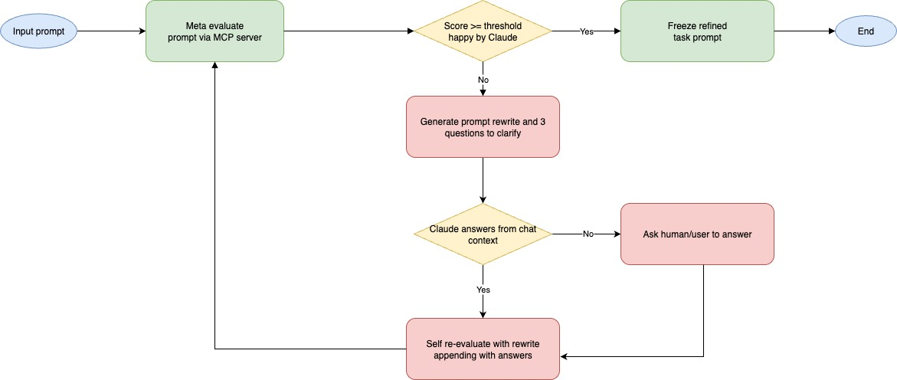
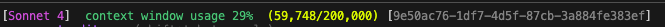

# Claude Code Misc Configurations

## 1. Meta-Prompter MCP

**Location**: `.claude/mcp/meta-prompter/`

A prompt evaluation tool available as both an MCP server and a standalone CLI. Grades prompts and returns JSON-only analysis across 8 dimensions (clarity, specificity, context, actionability, safety, testability, hallucination prevention, token efficiency) with weighted global scoring.

**Key Features**:
- Temperature-controlled evaluation (0 vs Claude Code's default 1)
- Machine-readable JSON output for agentic workflows
- Built-in result viewer with `eval-viewer.html`
- Support for multiple AI providers (Anthropic, OpenAI)

See [meta-prompter README](.claude/mcp/meta-prompter/README.md) for setup and usage.

## 2. Commands
**Location**: `.claude/commands/`

- **`/debug-partner`** - AI-assisted debugging partner for systematic troubleshooting
  - Evidence-based investigation with code-centric traces
  - Progressive clarification and hypothesis testing
  - Includes specific file names, function names, and line numbers
  - Collaborative approach with verification at each step

## 3. Routine Plugin
**Location**: `plugins/routine/`

A Claude Code plugin with skills for implementation, incident response, QA testing, and development tooling.

**Skills**:
- **Implementation**: forge, jira-ticket-viewer, jira-ticket-prioritizer, confluence-page-viewer, figma-reader, domain-discover, meta-prompter
- **QA / Testing**: qa-web-test, page-inspector
- **Incident Response**: pir, pagerduty-oncall, datadog-analyser, cloudflare-traffic-investigator
- **Development Tools**: oxlint, adr-author, a2a-js-dev

See [plugin README](plugins/routine/README.md) for setup and usage.

## 4. StatusLine
**Location**: `.claude/statusline/`

Context monitoring script (`ctx_monitor.js`) that displays real-time usage:
- Context window usage percentage (0-200k tokens) with color coding (green/yellow/red)
- Session ID and token consumption tracking
- Model name and usage statistics
- Automatic synthetic message filtering

