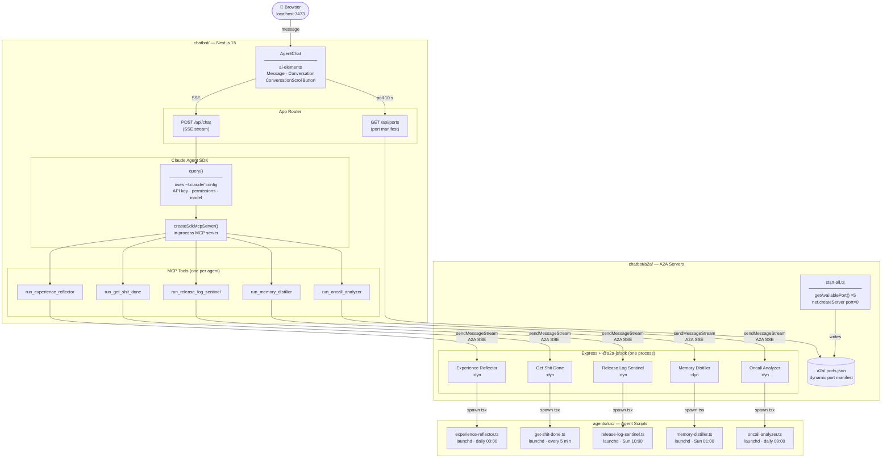
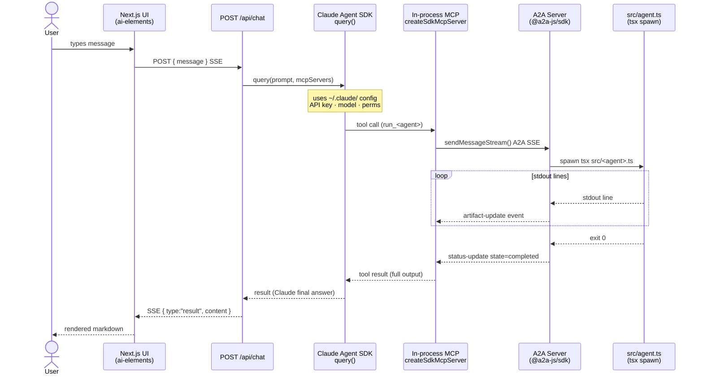
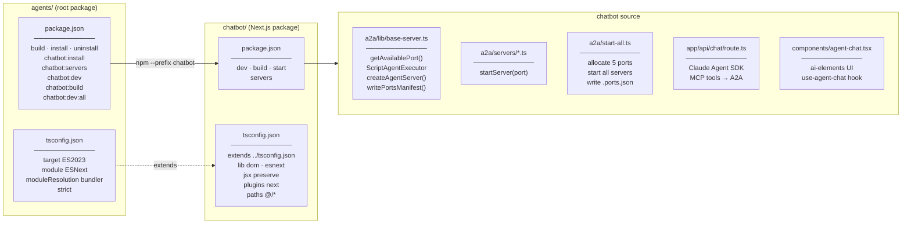

# Claude Agents

Background automation agents that run as launchd services on macOS, plus a chatbot UI to orchestrate them.

---

## Architecture

### System overview



### Request sequence



### Package structure



---

## Agents

Five TypeScript agents in `src/`, each managed as a launchd daemon:

| Agent | File | Schedule | Purpose |
|---|---|---|---|
| **Experience Reflector** | `src/experience-reflector.ts` | Daily 00:00 | Scans Claude Code checkpoint sessions, extracts domain knowledge into project `MEMORY.md` files |
| **Get Shit Done** | `src/get-shit-done.ts` | Every 5 min | Discovers JIRA sprint tickets, prioritises by dependency DAG, forges implementations in parallel git worktrees, creates PRs |
| **Release Log Sentinel** | `src/release-log-sentinel.ts` | Weekly Sun 10:00 | Monitors Claude Code releases for JSONL format changes that could break [tail-claude-gui](https://github.com/delexw/tail-claude-gui); creates GitHub issues for new findings |
| **Memory Distiller** | `src/memory-distiller.ts` | Weekly Sun 01:00 | Promotes patterns that appear across 2+ project `MEMORY.md` files into the global `~/.claude/CLAUDE.md` |
| **Oncall Analyzer** | `src/oncall-analyzer.ts` | Daily 09:00 | Generates Post Incident Records from PagerDuty incidents in the past 24 hours |

### Shared libraries (`src/lib/`)

| File | Role |
|---|---|
| `claude.ts` / `claude-runner.ts` | Spawn and stream Claude CLI subprocesses |
| `dag.ts` / `dag-store.ts` | Dependency graph for ticket ordering (LadybugDB backend) |
| `discovery.ts` | Sprint ticket discovery from JIRA |
| `prioritizer.ts` | Topological sort + LLM re-prioritisation |
| `pipeline.ts` | Forge → merge → verify → PR pipeline per ticket group |
| `orchestrator.ts` | Top-level GSD run loop |
| `jira.ts` | JIRA CLI wrapper |
| `dev-servers.ts` | Start/stop development servers for verification |
| `lock.ts` | File-based lock to prevent concurrent GSD runs |
| `repos.ts` | Parse repo paths from env vars |
| `prompts.ts` | Shared Claude prompt builders |
| `logger.ts` | Timestamped log files |
| `exec.ts` | `child_process` wrapper |

---

## Chatbot

`chatbot/` contains a Next.js 15 web UI that lets you chat with Claude to understand, configure, and trigger the agents. It uses three layers:

```
Browser
  └─ Next.js 15  (port 7473)
       └─ Claude Agent SDK  query()  — uses ~/.claude config
            └─ In-process MCP server  (5 tools, one per agent)
                 └─ A2A Client  sendMessageStream()
                      └─ A2A Server  (one per agent, dynamic port)
                           └─ tsx src/<agent>.ts  (stdout streamed as SSE)
```

### Request flow

1. User types a message in the browser.
2. `POST /api/chat` calls `query()` from `@anthropic-ai/claude-agent-sdk`, which uses the local `~/.claude/` config (API key, permissions, model).
3. Claude decides which tool to call. Each tool is backed by an in-process MCP server created with `createSdkMcpServer()`.
4. The tool opens an A2A SSE stream to the relevant agent server via `client.sendMessageStream()`.
5. The A2A server spawns the agent `.ts` script via `tsx` and forwards stdout lines as `artifact-update` SSE events.
6. Results bubble back up: agent script → A2A SSE → MCP tool return value → Claude's final answer → SSE to browser.

### Dynamic port allocation

Agent servers start on OS-assigned ports (no hardcoded numbers):

```ts
// net.createServer + port 0 — built-in Node.js, no external deps
const port = await getAvailablePort();
```

`a2a/start-all.ts` allocates 5 ports concurrently, starts all servers, then writes `chatbot/a2a/.ports.json`:

```json
{
  "experience_reflector": 52341,
  "get_shit_done": 52342,
  "release_log_sentinel": 52343,
  "memory_distiller": 52344,
  "oncall_analyzer": 52345,
  "updatedAt": "2026-03-21T10:00:00.000Z"
}
```

The Next.js API route reads this file fresh on each tool invocation. `GET /api/ports` serves it to the sidebar so it can display live port numbers.

### UI components

Built with real components installed via `npx ai-elements@latest`:

| Component | Source | Purpose |
|---|---|---|
| `Message` + `MessageContent` + `MessageResponse` | `ai-elements` | Per-message layout; `MessageResponse` renders Streamdown markdown |
| `Conversation` + `ConversationContent` | `ai-elements` | Auto-scroll container (StickToBottom) |
| `ConversationEmptyState` | `ai-elements` | Welcome screen with suggestion chips |
| `ConversationScrollButton` | `ai-elements` | Scroll-to-bottom FAB |
| shadcn/ui (`button`, `select`, `tooltip`, …) | installed by ai-elements CLI | Base primitives |

Custom hook `components/hooks/use-agent-chat.ts` drives the SSE connection to `/api/chat` (abort controller, streaming accumulation, error handling).

---

## Project structure

```
agents/
├── src/                          # Agent scripts (run as launchd daemons)
│   ├── experience-reflector.ts
│   ├── get-shit-done.ts
│   ├── release-log-sentinel.ts
│   ├── memory-distiller.ts
│   ├── oncall-analyzer.ts
│   └── lib/                      # Shared utilities
├── chatbot/                      # Next.js chatbot (orchestrator UI)
│   ├── a2a/
│   │   ├── lib/
│   │   │   └── base-server.ts    # getAvailablePort(), ScriptAgentExecutor, createAgentServer()
│   │   ├── servers/              # One A2A server per agent
│   │   │   ├── experience-reflector.ts   → export startServer(port)
│   │   │   ├── get-shit-done.ts
│   │   │   ├── release-log-sentinel.ts
│   │   │   ├── memory-distiller.ts
│   │   │   └── oncall-analyzer.ts
│   │   ├── start-all.ts          # Allocate ports → start all servers → write .ports.json
│   │   └── .ports.json           # Runtime port manifest (git-ignored)
│   ├── app/
│   │   ├── api/
│   │   │   ├── chat/route.ts     # Claude Agent SDK + MCP tools → A2A → SSE stream
│   │   │   └── ports/route.ts    # GET .ports.json for sidebar
│   │   ├── globals.css
│   │   ├── layout.tsx
│   │   └── page.tsx
│   ├── components/
│   │   ├── ai-elements/          # Installed via npx ai-elements@latest
│   │   │   ├── message.tsx       # Message, MessageContent, MessageResponse (Streamdown)
│   │   │   ├── conversation.tsx  # Conversation, ConversationContent, ConversationScrollButton
│   │   │   └── prompt-input.tsx  # (installed; custom ChatInput used instead)
│   │   ├── ui/                   # shadcn/ui primitives (installed by ai-elements)
│   │   ├── hooks/
│   │   │   └── use-agent-chat.ts # SSE chat hook
│   │   └── agent-chat.tsx        # Main UI — sidebar + conversation + input
│   ├── lib/utils.ts              # cn() Tailwind merge helper
│   ├── next.config.ts
│   ├── tailwind.config.ts
│   ├── tsconfig.json             # extends ../tsconfig.json
│   └── package.json             # chatbot deps only; scripts managed from parent
├── package.json                  # Root scripts (see below)
├── tsconfig.json                 # Base TypeScript config
└── README.md
```

---

## TypeScript configuration

`chatbot/tsconfig.json` extends the parent `tsconfig.json`:

```jsonc
{
  "extends": "../tsconfig.json",        // inherits: target, module, moduleResolution, strict, …
  "compilerOptions": {
    "lib": ["dom", "dom.iterable", "esnext"],  // add browser types
    "noEmit": true,                             // Next.js handles emit via SWC
    "jsx": "preserve",                          // SWC handles JSX transform
    "plugins": [{ "name": "next" }],
    "paths": { "@/*": ["./*"] }
  }
}
```

---

## Scripts (all run from `agents/`)

```bash
# ── Agents (launchd) ──────────────────────────────
npm run build           # compile src/ with tsup → dist/
npm run install         # register launchd plists (build first)
npm run uninstall       # unregister launchd plists

# ── Chatbot ───────────────────────────────────────
npm run chatbot:install   # install chatbot/node_modules
npm run chatbot:servers   # start 5 A2A servers on dynamic ports
npm run chatbot:dev       # start Next.js dev server (port 7473)
npm run chatbot:build     # production build
npm run chatbot:dev:all   # chatbot:servers + chatbot:dev in parallel
```

### First-time setup

```bash
# 1. Install root deps (includes concurrently)
npm install

# 2. Install chatbot deps
npm run chatbot:install

# 3. Start everything
npm run chatbot:dev:all
# → A2A servers start, write chatbot/a2a/.ports.json
# → Next.js dev server starts at http://localhost:7473
```

---

## Environment variables

### Experience Reflector
| Variable | Example | Description |
|---|---|---|
| `CHECKPOINT_REPOS` | `/path/to/repo1:/path/to/repo2` | Colon-separated list of repo paths to scan |

### Get Shit Done
| Variable | Example | Description |
|---|---|---|
| `GSD_REPOS` | `/path/to/repo1:/path/to/repo2` | Repos to forge implementations in |
| `JIRA_ASSIGNEE` | `yang.liu` | JIRA username to filter sprint tickets |
| `JIRA_CLI` | `/opt/homebrew/bin/jira` | Path to jira CLI (default: `/opt/homebrew/bin/jira`) |
| `JIRA_SERVER` | `https://company.atlassian.net` | JIRA server URL |
| `JIRA_SPRINT_PREFIX` | `Sprint` | Sprint name prefix for discovery |
| `GSD_CWD` | `/path/to/main/repo` | Working directory for Claude forge sessions |

### Memory Distiller
| Variable | Example | Description |
|---|---|---|
| `MEMORY_REPOS` | `/path/to/repo1:/path/to/repo2` | At least 2 repos with `MEMORY.md` files |

### Oncall Analyzer
| Variable | Example | Description |
|---|---|---|
| `PIR_REPOS` | `/path/to/repo1:/path/to/repo2` | Repos to fetch before analysis |
| `PIR_DOMAIN` | `company.com` | Cloudflare domain for traffic correlation |
| `PIR_ZONE_ID` | `abc123` | Cloudflare zone ID |

### Release Log Sentinel
Requires `gh` CLI authenticated (`gh auth login`). No env vars needed.

---

## Key dependencies

### Root (`agents/`)
| Package | Purpose |
|---|---|
| `@ladybugdb/core` | Embedded property graph DB for GSD ticket DAG |
| `tsx` | Run TypeScript agents directly without pre-compilation |
| `tsup` | Bundle agents for launchd deployment |
| `concurrently` | Run chatbot:servers + chatbot:dev in parallel |

### Chatbot (`chatbot/`)
| Package | Purpose |
|---|---|
| `@anthropic-ai/claude-agent-sdk` | Run Claude as an agentic loop; uses `~/.claude/` config |
| `@a2a-js/sdk` | A2A protocol client + server (Express transport + SSE) |
| `next` | Web framework for the chatbot UI |
| `streamdown` | Streaming markdown renderer used by `MessageResponse` |
| `use-stick-to-bottom` | Auto-scroll for `Conversation` |
| `zod` v4 | Schema validation for MCP tool parameters |
| `express` | HTTP server for each A2A agent endpoint |
